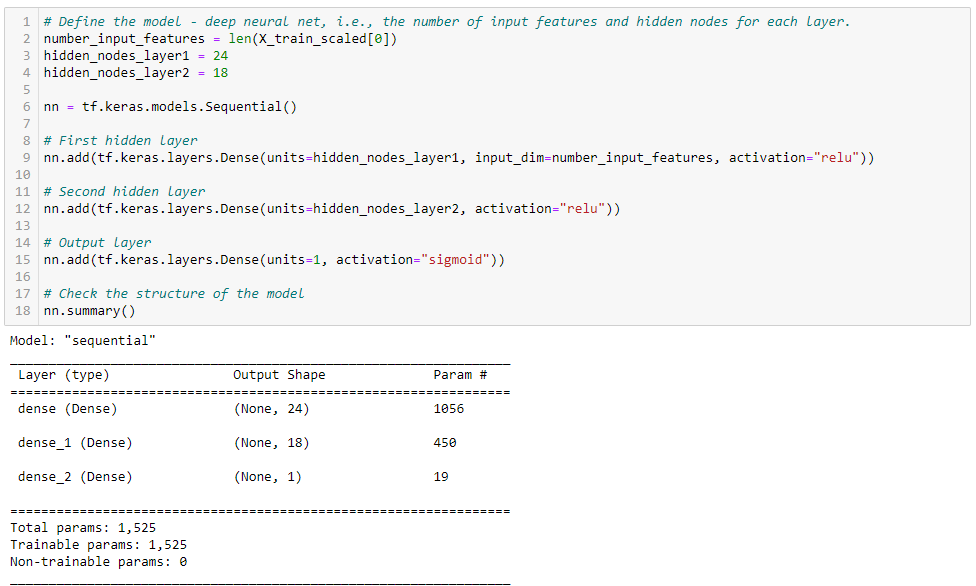
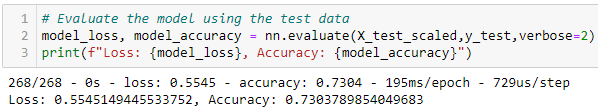
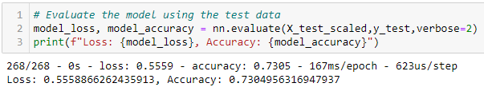
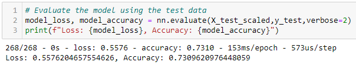

# Neural_Network_Charity_Analysis
## Objective
The objective of this challenge was to develop a neural network utilizing the TensorFlow library and machine learning in Jupyter Notebook to develop a binary classifier that could predict whether applicants for charitable funds would be successful in their endeavors upon funding. To accomplish this task, we have to:
- preprocess the data for optimal entry into a neural network model
- compile, train, and evaluate the model, and
- optimize the model based on initial output

Ultimately, the objective is to develop a model that is able to predict the outcome of a loan application to lead to a successful project with accuracy ≥75%.
 
## Results
**Data Preprocessing**
- The variable ```IS_SUCCESSFUL``` was the target of the neural network model for this analysis.
- Features of the model included in the analysis included all variables besides ```IS_SUCCESSFUL```. This would include our categorical variables as well as our continuous variables.
- The variable columns ```EIN``` and ```NAME``` were dropped from the dataframe as they did not provide data of analytic value. A final analysis (Attempt #4) also dropped the ```INCOME_AMT``` column, which was found to have little effect on the model results.

**Compiling, Training, and Evaluating the Model**
- The initial deep learning model was developed using two hidden layers, the first having 24 nodes, and the second having 18 nodes. The input data contained 43 features which led to 1,056 parameters for the first layer and 450 for the second. The total count of parameters was 1,525. Both hidden layers utilized the ```relu``` activation function.<br><kbd><kbd>
- The initial model was not able to achieve a target model performance of 75%, as shown below. The accuracy was 73.0% with a loss of 55.5%.<br><kbd><kbd>
- To improve model accuracy, we optimized the model using the following methods:
  - Adding an additional hidden layer, which had no change on the accuracy of 73.0%<br><kbd><kbd>
  - Adding additional neurons, which had a very small change on the accuracy, increasing to 73.1%<br><kbd><kbd>
  - Changing the activation function of the second and third layers to xx and xx respectively, which had a small negative change on the accuracy to 72.9%<br><kbd><kbd>
  - Re-running the data cleaning to remove the ```INCOME_AMT``` column, which resulted in a small change to the model accuracy (all other parameters were identical to Attempt #1) to 73.1%.<br><kbd><kbd>

## Summary/Conclusions
In conclusion, running multiple deep learning neural network models resulted in all findings being approximately 73.0% accurate in predicting the outcome of a loan application. This is below our stated threshold of ≥75%. Future analyses should include other supervised machine learning methods, such as random forest classifiers and logistic regressions that can more easily manage binary classification issues such as our yes/no decision on funding the applicant charities. Bayesian analysis, with its ability to evaluate the probability of an even given additional information, could also be a reasonable option.
